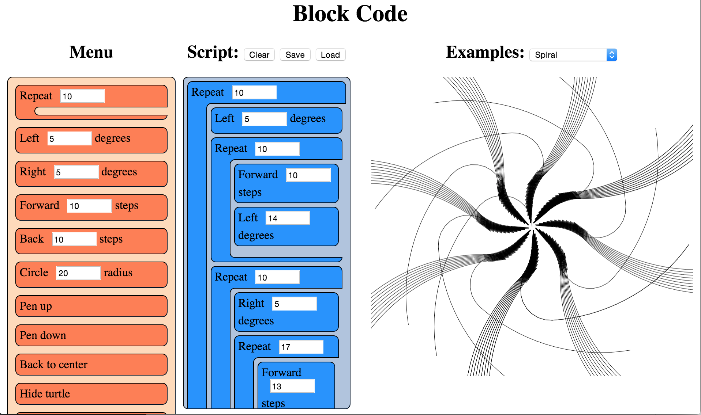

### [Dethe Elza](https://twitter.com/dethe)

[Dethe](https://twitter.com/dethe) 是一名极客父亲，具有审美趣味的程序员，导师以及[ WaterBear 可视化编程工具](http://waterbearlang.com/) 的作者。他与人合办温哥华制作教育沙龙，想要折纸兔子机器人火遍全世界。

[Dethe] (https://twitter.com/dethe) is a geek dad, aesthetic programmer, mentor, and creator of the [WaterBear] (http://waterbearlang.com/) visual programming tool. He co-hosts the Vancouver Make Education Salons and wants to fill the world with robotic origami rabbits.

在基于块的编程语言中，你通过拖动连接表示程序不同部分的块编写程序的。块编程语言不同于传统编程语言，在常规编程语言中你需要输入字符。

In block-based programming languages, you write programs by dragging and connecting blocks that represent parts of the program. Block-based languages differ from conventional programming languages, in which you type words and symbols.

学习一门编程语言可能会很难，因为它们不能容忍丝毫的错别字。大多数的编程语言是区分大小写的, 语法晦涩难懂, 并且如果在错误的地方多写了一个分号程序就会拒绝执行，更糟糕的是少写了一个分号。更有甚者, 现在的大多数编程语言是基于英语的，并且它们的语法不能本地化。

Learning a programming language can be difficult because they are extremely sensitive to even the slightest of typos. Most programming languages are case-sensitive, have obscure syntax, and will refuse to run if you get so much as a semicolon in the wrong place or worse leave one out. Further, most programming languages in use today are based on English and their syntax cannot be localized.

相反，一个出色的块编程语言可以完全消除语法错误。你仍然会创建一个执行错误的程序，但不能创建一个语法错误的程序：块语言就是不会发生这样的错误。块语言也更加直观：你可以在语言的块列表中看到所有的结构和软件库。而且，块语言可以在不改变编程语言含义的情况下本地化为任何人类语言。

In contrast, a well-done block language can eliminate syntax errors completely. You can still create a program which does the wrong thing, but you cannot create one with the wrong syntax: the blocks just won't fit that way. Block languages are more discoverable: you can see all the constructs and libraries of the language right in the list of blocks. Further, blocks can be localized into any human language without changing the meaning of the programming language.

Figure 1.1 - The BlockCode IDE in use

基于块的编程语言有着悠久的历史，其中一些突出的有 [Lego Mindstorms](http://www.lego.com/en-us/mindstorms/) ，[Alice3D](https://www.alice.org/)，[StarLogo](https://education.mit.edu/project/starlogo-tng/)，尤其是 [Scratch](http://scratch.mit.edu/)。在网络上也有一些基于块语言的工具：[Blockly](https://developers.google.com/blockly/)，[AppInventor](http://appinventor.mit.edu/)，[Tynker](https://www.tynker.com/)，以及[更多](https://zh.wikipedia.org/wiki/%E8%A6%96%E8%A6%BA%E5%8C%96%E7%A8%8B%E5%BC%8F%E8%A8%AD%E8%A8%88%E8%AA%9E%E8%A8%80)。

Block-based languages have a history, with some of the prominent ones being [Lego Mindstorms](http://www.lego.com/en-us/mindstorms/) , [Alice3D](https://www.alice.org/), [StarLogo](https://education.mit.edu/project/starlogo-tng/), and especially [Scratch](http://scratch.mit.edu/). There are several tools for block-based programming on the web as well: [Blockly](https://developers.google.com/blockly/), [AppInventor](http://appinventor.mit.edu/), [Tynker](https://www.tynker.com/), and [many more](https://en.wikipedia.org/wiki/Visual_programming_language).
